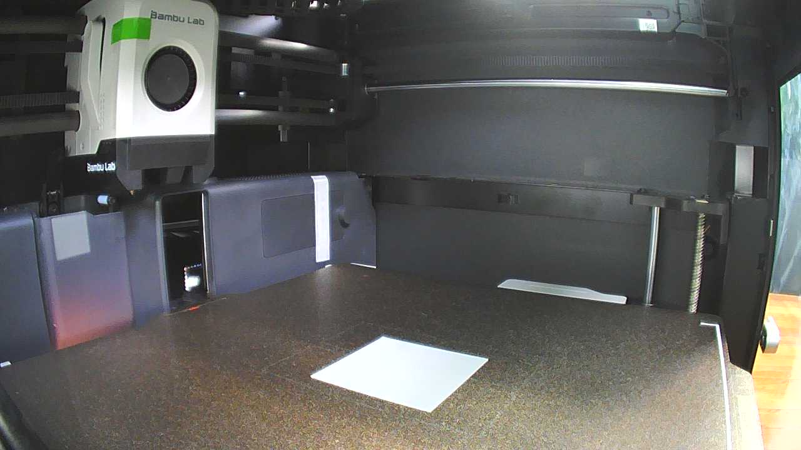
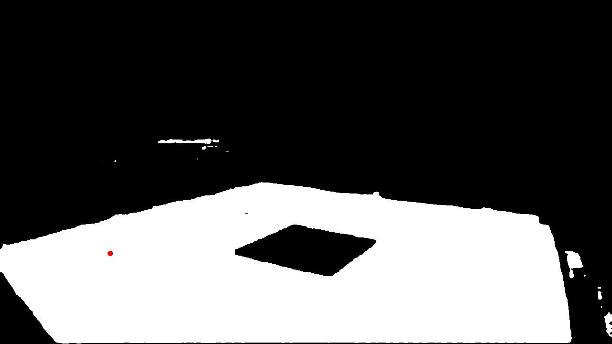
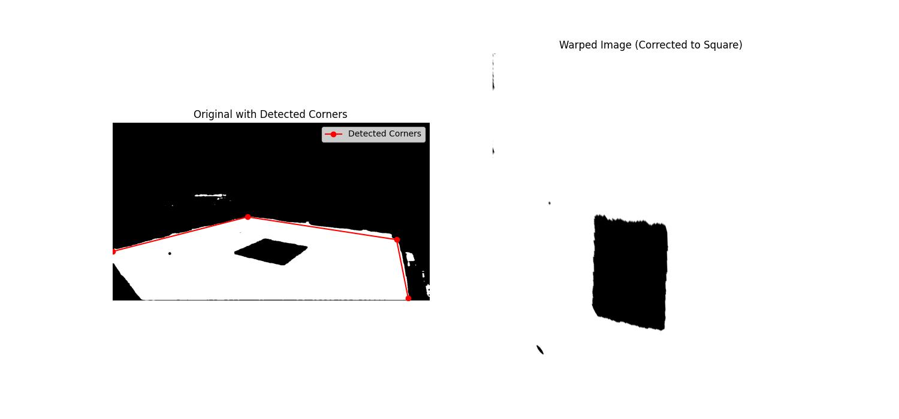

# bambushot

This is a small exploratory project to turn your Bambu printer into a camera booth 

While this project is not intended to be used in production and is a collection of scripts, parts of this can be reconfigured to build a more useful application/tool.

## Ideas for future work

- [ ] check if the printer bed is empty
- [ ] vqa query the printer bed
- [ ] apply (better) projection scaling to allow measuring the distance between objects

## Setup

We are using a `50mm` x `50mm` x `0.5mm` square as a reference object. Please print `measure_plate.3mf` at the center of the printer bed to match the examples.


## Scripts

`shot.py` will move the printer to `200mm` then slowly up to `40mm` and taking pictures along the way.

```bash
uv run scripts/shot.py
# Sending G-code command: G1 Z200 F1000
# Finished moving to position
# Sending G-code command: G1 Z40 F100
# Saving frame to frames/latest_frame_1.jpg
# ...
# Saving frame to frames/latest_frame_50.jpg
```




segment the image into a mask



```bash
uv run scripts/seg.py
# Number of masks: 1
# Original mask shape: torch.Size([3, 720, 1280])
# After squeeze shape: (720, 1280)
```

```bash
uv run scripts/fit.py
```

